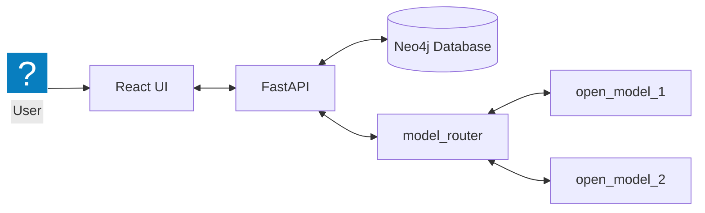

# Terminology Architecture

## Application architecture

The user creates, reads, updates, and deletes terms through the React UI. React sends those requests to FastAPI, which reads or writes term data in Neo4j and exchanges prompts and responses with a small open model.

## CRUD and persistence boundaries

| User action       | HTTP request                | Persistence path                           |
| ----------------- | --------------------------- | ------------------------------------------ |
| Search for a term | `GET /terms/{term_name}`    | `TermNode.match(...)`                      |
| Create a term     | `POST /terms/`              | `GraphConnection` + Cypher `CREATE`        |
| Edit a term       | `PATCH /terms/{term_name}`  | `GraphConnection` + Cypher `MATCH`/`SET`   |
| Delete a term     | `DELETE /terms/{term_name}` | `GraphConnection` + Cypher `DETACH DELETE` |
