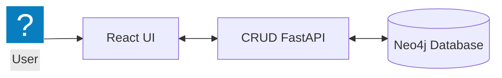

# Terminology Architecture

## Current implemented architecture

The user creates, reads, updates, and deletes terms through the React UI. React sends those requests to FastAPI, and FastAPI reads or writes the term data in Neo4j.

## CRUD and persistence boundaries

| User action       | HTTP request                | Persistence path                           |
| ----------------- | --------------------------- | ------------------------------------------ |
| Search for a term | `GET /terms/{term_name}`    | `TermNode.match(...)`                      |
| Create a term     | `POST /terms/`              | `GraphConnection` + Cypher `CREATE`        |
| Edit a term       | `PATCH /terms/{term_name}`  | `GraphConnection` + Cypher `MATCH`/`SET`   |
| Delete a term     | `DELETE /terms/{term_name}` | `GraphConnection` + Cypher `DETACH DELETE` |

## Current boundaries

- The browser client is coupled to `http://localhost:8000`, while Vite runs on port `3030`.
- FastAPI allows browser requests only from `localhost:3030` and `127.0.0.1:3030`.
- The stored graph currently has one node type, `Term`, with no implemented relationships.
- The UI and backend models include a `diagram` value, but the current create and update fetch bodies send only `name` and `definition`.
- The active Docker Compose service is an Open WebUI experiment connected to a host Ollama endpoint. Neo4j, FastAPI, and the React service are currently commented out, and no application code calls Open WebUI or Ollama.
